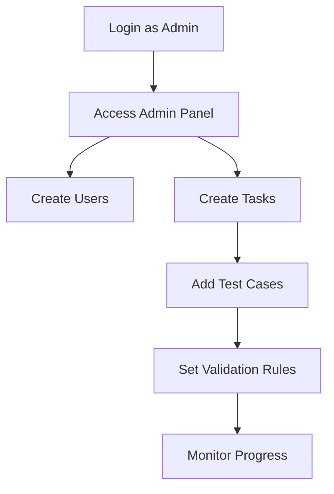
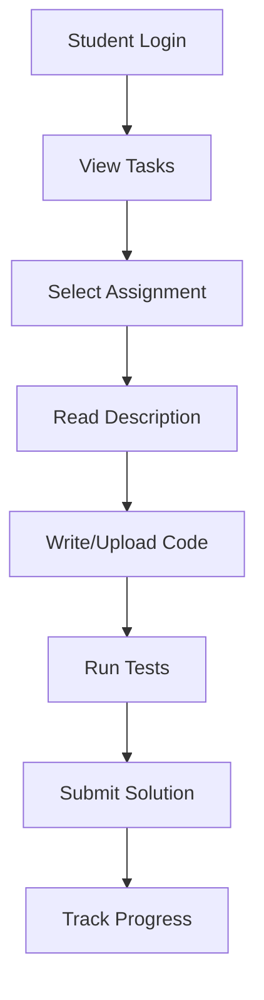

# 🎓 PyGrader

<div align="center">

**A Modern Desktop Application for Programming Assignment Management**


*Organize, check, and manage programming assignments with style* ✨

  


</div>
 
---

## 🌟 Overview

PyGrader is a sleek desktop application designed for educators and students to streamline programming assignment workflows. Built with modern UI components and robust security features, it provides an intuitive platform for task management and automated code evaluation.

### ✨ **Key Highlights**
- 🎨 **Modern Interface** - Built with `customtkinter` for a contemporary look
- 🔒 **Secure Storage** - Encrypted SQLite database for all data
- 🐳 **Docker Integration** - Optional containerized code execution for safety
- 🌙 **Dark Theme** - Easy on the eyes with animated backgrounds
- ⚡ **Real-time Testing** - Instant feedback on code submissions

---

## 🚀 Features

### 👨‍🎓 **Student Features**
| Feature | Description |
|---------|-------------|
| 🔐 **Secure Login** | Personal accounts with encrypted authentication |
| 📋 **Task Overview** | View assigned tasks with clear descriptions and deadlines |
| 💻 **Code Editor** | Built-in editor with syntax highlighting and file upload |
| 🧪 **Live Testing** | Run code against provided test cases instantly |
| 📊 **Progress Tracking** | Monitor test results and submission history |

### 👨‍💼 **Administrator Features**
| Feature | Description |
|---------|-------------|
| 👥 **User Management** | Create and manage student/admin accounts |
| 📝 **Task Creation** | Design programming tasks with custom test cases |
| 🔍 **Validation Rules** | Set up automated code validation criteria |
| 📈 **Progress Monitoring** | Track student submissions and performance |
| ⚙️ **System Administration** | Full control over application settings |

---

## 📦 Installation

### 🔧 **Prerequisites**
- **Python 3.10+** (recommended)
- **Docker** (optional, for isolated code execution)

### 📥 **Quick Install**

1. **Install Core Dependencies**
   ```bash
   pip install customtkinter cryptography
   ```

2. **Optional: Docker Support**
   ```bash
   pip install docker
   ```
   > ⚠️ **Note:** Ensure Docker daemon is running for containerized execution

3. **Optional: Enhanced Theming**
   ```bash
   pip install ttkbootstrap
   ```

### 🎯 **Alternative Installation**
```bash
# One-liner for all dependencies
pip install customtkinter cryptography docker ttkbootstrap
```

---

## 🏃‍♂️ Quick Start

### 1️⃣ **Launch Application**
```bash
python main.py
```

### 2️⃣ **First Login**
On initial startup, a default administrator account is automatically created:
- **Username:** `admin`
- **Password:** `admin`

> 🔒 **Security Note:** Change default credentials immediately after first login!

### 3️⃣ **Getting Started**
1. Select **Admin Mode** on the login screen
2. Create additional user accounts and programming tasks
3. Students can then log in and start working on assignments

---

## 💡 Usage Guide

### 🎛️ **Administrator Workflow**



**Steps:**
1. **Login** → Toggle *Admin Mode* during authentication
2. **User Management** → Create accounts with appropriate permissions
3. **Task Creation** → Design assignments with comprehensive test suites
4. **Monitoring** → Track student progress and submissions

### 👨‍🎓 **Student Workflow**



**Steps:**
1. **Login** → Access your assigned tasks
2. **Task Selection** → Choose from available assignments
3. **Development** → Write code using built-in editor or upload files
4. **Testing** → Validate solution against provided test cases
5. **Submission** → Submit completed work for evaluation

---

## 🎨 Interface Features

- **🌙 Dark Theme** - Modern, eye-friendly interface
- **🎬 Animated Backgrounds** - Smooth transitions and visual effects
- **📱 Responsive Layout** - Adapts to different screen sizes
- **🔔 Real-time Notifications** - Instant feedback on actions
- **📊 Progress Indicators** - Visual representation of completion status

---

## 🐳 Docker Integration

PyGrader supports optional Docker integration for secure code execution:

| Mode | Description | Security | Performance |
|------|-------------|----------|-------------|
| **Docker** | Code runs in isolated containers | 🟢 High | 🟡 Moderate |
| **Host** | Code runs directly on system | 🟡 Moderate | 🟢 Fast |

Docker integration provides:
- 🛡️ **Isolation** - Student code runs in sandboxed environment
- 🔒 **Security** - Protection against malicious code execution
- 🧹 **Clean Environment** - Fresh container for each test run

---

## 🔧 Configuration

The application automatically configures itself on first run, but you can customize:

- **Database Location** - Modify SQLite file location
- **Docker Settings** - Configure container parameters
- **UI Themes** - Customize appearance and animations
- **Security Settings** - Adjust encryption parameters

---
 ACCENT_ORANGE   = "#f97316"  # neon orange
ACCENT_LIME     = "#a3e635"  # acid lime
ACCENT_CYAN     = "#22d3ee"  # vivid cyan
SOFT_WHITE      = "#f4f4f5"  # soft white
DARK_BACKGROUND = "#0f0f0f"  # pitch black background
GRAY_BORDER     = "#3f3f46"  # border and divider gray


<div align="center">


** Make in colaborate with PYHub pro desighner**
 

</div>
